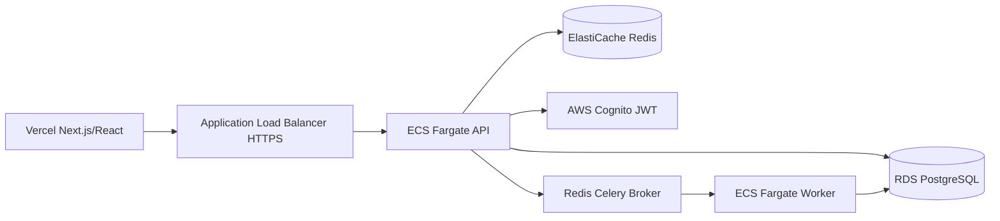

# goverp-core-ai

ERP governamental multi-tenant com API assíncrona, fila de análise de IA, cache Redis e índices PostgreSQL orientados a relatórios. O frontend pode ser hospedado na Vercel e o backend cloud-native roda em ECS Fargate, RDS, ElastiCache e Cognito provisionados por Terraform.

## Arquitetura



- `app/api`: controllers FastAPI, dependências HTTP e schemas Pydantic; são adapters de entrada.
- `app/domain`: entidades, Value Objects e interfaces abstratas; não importa frameworks.
- `app/application`: DTOs e casos de uso que orquestram o negócio através das portas.
- `app/infrastructure`: adapters concretos SQLAlchemy async, Redis, Celery e Cognito.
- `app/db`: sessão async e aliases de compatibilidade para Alembic.
- `app/models`: fachada de compatibilidade; o ORM canônico vive em `app/infrastructure/persistence`.
- `app/workers`: entrypoints Celery que delegam ao application layer.
- `migrations`: histórico Alembic.
- `benchmarks`: evidências e metodologia de tuning.
- `terraform/modules/ecs`: ALB, cluster Fargate, API, worker, secrets e autoscaling.

## Decisões de design

- **Multi-tenancy por tenant ID**: cada request exige `X-Tenant-ID`; todas as consultas CRUD e agregações filtram o `tenant_id`, evitando vazamento entre organizações.
- **Pydantic v2**: valida limites de texto, valores positivos e precisão monetária antes de tocar no banco.
- **SQLAlchemy async**: o pool async evita bloquear o event loop da API e mantém o mesmo modelo compatível com testes SQLite.
- **Celery + Redis**: análise de IA é enfileirada; o worker simula 2 segundos e grava `ANALISADO` ou `ALERTA_RISCO`.
- **Cache Redis**: relatório é isolado por tenant, expira em 60 segundos e é invalidado após criação de licitação.

## Clean Architecture e DDD

O fluxo de uma requisição segue `API -> Application -> Domain`, enquanto os adapters concretos implementam as portas definidas no domínio:

```text
FastAPI/Pydantic
    |
    v
Use Cases + DTOs  --->  Domain Entities + Repository Ports
    |                              ^
    v                              |
SQLAlchemy/Redis/Celery/Cognito ------+
```

As entidades `Licitacao` e `TenantId` são Python puro. O SQLAlchemy converte entre `LicitacaoModel` e a entidade; Redis e Celery são adapters substituíveis. Isso permite testar regras de negócio sem banco, fila ou AWS e mantém a infraestrutura fora do núcleo.

## Como executar

Pré-requisitos: Python 3.11, Docker Desktop e Docker Compose.

```powershell
Copy-Item .env.example .env
docker compose up -d postgres redis
# no ambiente Python configurado:
python -m pip install -e ".[dev]"
alembic upgrade head
uvicorn app.main:app --reload
```

Para API, worker e serviços locais em containers:

```powershell
docker compose up -d --build
```

O LocalStack sobe junto e expõe SQS, KMS e Secrets Manager em `localhost:4566`.

```powershell
docker compose ps
```

## AWS e ECS Fargate

O diretório [terraform](terraform) provisiona uma VPC em duas AZs, subnets públicas/privadas, NAT gateways, KMS, RDS PostgreSQL, ElastiCache Redis, Cognito User Pool, ALB e dois serviços ECS Fargate: API e worker Celery.

| Ambiente | Compute | Banco | Redis | Rede | Autoscaling |
| --- | --- | --- | --- | --- | --- |
| staging | 1 task API + 1 worker, 0.25 vCPU/0.5 GB | RDS `db.t4g.micro`, Single-AZ | `cache.t4g.micro`, single-node | 1 NAT Gateway | Sem autoscaling obrigatório |
| prod | mínimo 2 tasks API + 2 workers | RDS Multi-AZ | 2 nós `cache.r7g.large` | 2 NAT Gateways | API e worker: 2–10 tasks |

```powershell
Copy-Item terraform\terraform.tfvars.example terraform\terraform.tfvars
terraform -chdir=terraform init
terraform -chdir=terraform validate
terraform -chdir=terraform plan
terraform -chdir=terraform apply
```

Para staging, use `terraform -chdir=terraform plan -var='environment=staging'`. Para produção, forneça uma imagem publicada no ECR, certificado ACM e o e-mail de budget:

```powershell
terraform -chdir=terraform apply `
    -var='environment=prod' `
    -var='api_image=ACCOUNT.dkr.ecr.us-east-1.amazonaws.com/goverp-api:TAG' `
    -var='worker_image=ACCOUNT.dkr.ecr.us-east-1.amazonaws.com/goverp-worker:TAG' `
    -var='certificate_arn=arn:aws:acm:...' `
    -var='budget_alert_email=ops@example.com'
```

O módulo ECS injeta os valores de RDS, Redis e Cognito diretamente do AWS Secrets Manager nas duas task definitions. Nenhum segredo real deve ser commitado. O budget é criado somente quando `budget_alert_email` é informado.

### Autenticação

As rotas de domínio exigem `Authorization: Bearer <Cognito access token>` e `X-Tenant-ID`. A API baixa as chaves públicas JWKS com cache de processo, valida assinatura RS256, issuer, expiração, `token_use`, `client_id` e o claim imutável `custom:tenant_id`. Um tenant do token diferente do header recebe `403`.

## Endpoints

- `GET /health`
- `POST/GET /api/v1/licitacoes/`
- `GET /api/v1/licitacoes/{id}`
- `POST /api/v1/licitacoes/{id}/analisar-ia`
- `GET /api/v1/relatorios/gastos-totais`

Todos os endpoints de domínio exigem o header `X-Tenant-ID`.

## Benchmark e tuning

```powershell
python -m app.db.seed_benchmark --total 500000 --batch-size 5000
pytest -q
```

A migração `0002_reporting_indexes` adiciona índices compostos por tenant/status/data e um índice parcial para registros ativos. Os planos `EXPLAIN (ANALYZE, BUFFERS)` antes/depois e a metodologia estão em [benchmarks/explain_analyze_results.md](benchmarks/explain_analyze_results.md).

## Testes

```powershell
pytest -q
ruff check .
```

## Teste de carga e autoscaling ECS

O cenário [tests/load_test_locust.py](tests/load_test_locust.py) alterna requisições entre múltiplos tenants e exercita listagem e relatório. Use somente um access token Cognito de teste:

```powershell
$env:LOCUST_TENANT_IDS="00000000-0000-0000-0000-000000000001,00000000-0000-0000-0000-000000000002"
$env:LOCUST_ACCESS_TOKEN="TOKEN_DE_TESTE"
locust -f tests/load_test_locust.py --host=https://api.goverp.example.com --headless -u 100 -r 10 -t 10m
```

Durante o teste, acompanhe `aws ecs describe-services` e as métricas `CPUUtilization`/`MemoryUtilization` no CloudWatch. Em produção, o Application Auto Scaling mantém 2 tasks como mínimo e pode escalar API e worker até 10 tasks conforme CPU de 70%.
